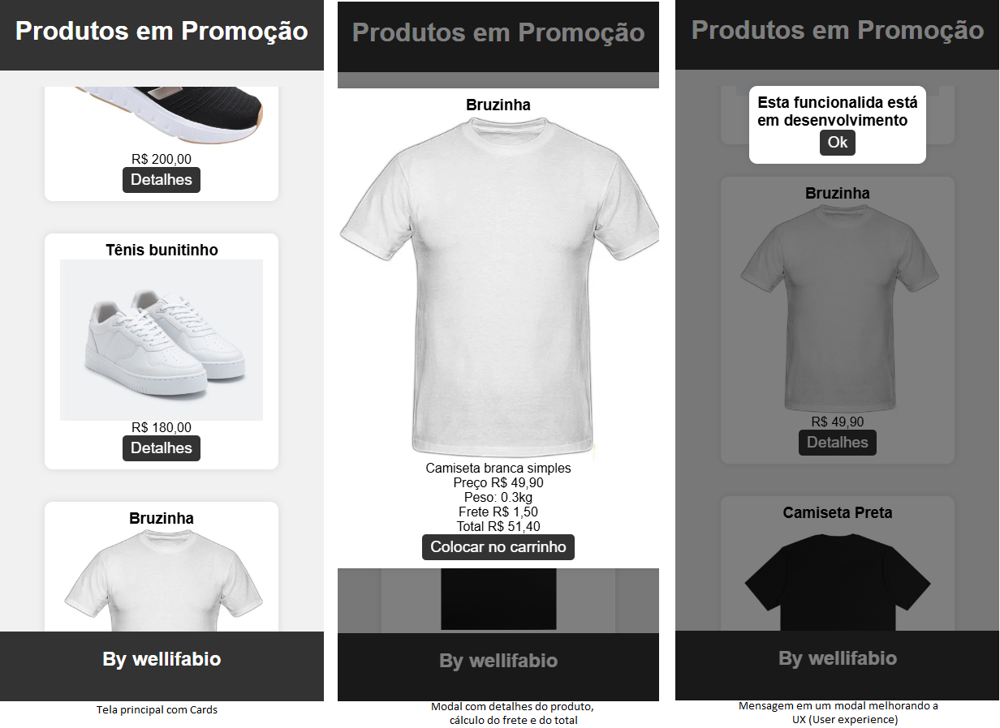

# Listar Cards Produtos
Exemplo de aplicativo web front-end, que lista dados de um vetor JSON e renderiza em forma de **Cards**, mostra os detalhes de cada produto em um **modal** e também melhora a UX (User experience) exibindo mensagens em um modal ao inves de alert().

## Requisitos
- [VsCode](https://code.visualstudio.com/)

## Instalação
1. Clone este repositório
2. Abra com o VsCode 
3. Execute o arquivo **index.html** no navegador ou via live server do VsCode.
A imagem a seguir mostra o as telas no formato responsivo.
